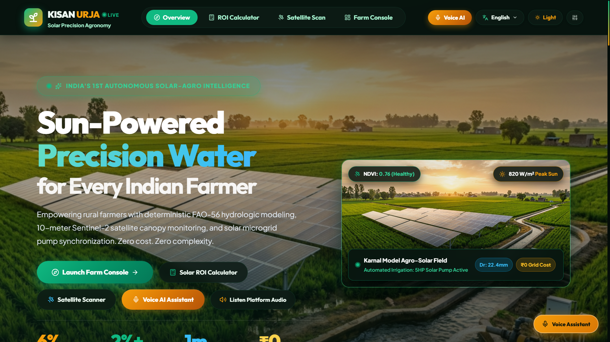
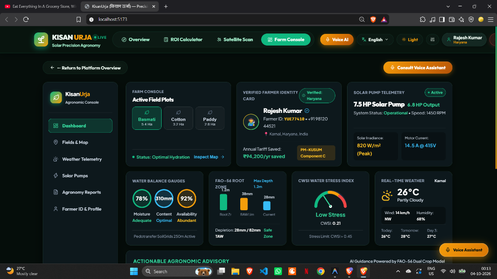
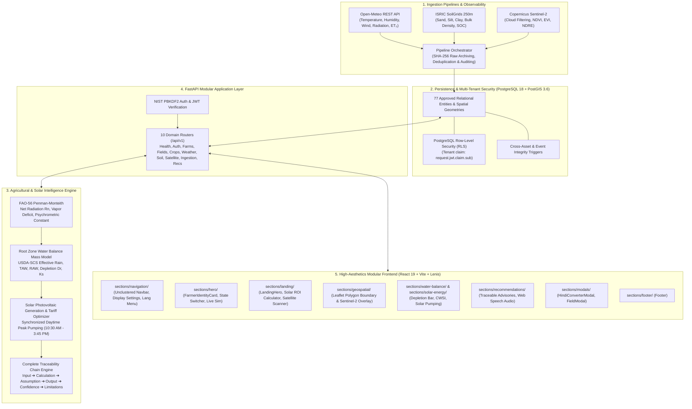

# ☀️ KISAN URJA (किसान ऊर्जा) — Autonomous Agricultural Intelligence & Solar Irrigation Platform

[](https://kisanurja.vercel.app)
[](https://kisan-urja.vercel.app)
[](https://github.com/nikhillakra2007-tech/yuva-energy)
[](http://localhost:5173/)
[](https://fastapi.tiangolo.com)
[](https://react.dev)
[](https://www.postgresql.org)
[](https://www.fao.org/3/x0490e/x0490e00.htm)
[](https://www.docker.com)

> **KisanUrja (किसान ऊर्जा)** is India's 1st autonomous precision agriculture and renewable irrigation intelligence setu. It fuses real-time microclimate observations, pedotransfer soil hydraulics, and 10-meter Copernicus Sentinel-2 satellite canopy monitoring with deterministic **FAO-56 Penman-Monteith** evapotranspiration physics to synchronize solar-powered irrigation pumps—decoupling agricultural water pumping from costly grid electricity and diesel gensets while preserving groundwater aquifers.

---

## 🔗 Quick Site & Repository Access Links

| Asset / Endpoint | Live URL | Description |
|:---|:---|:---|
| **🚀 Production Deployed Site** | **[https://kisanurja.vercel.app](https://kisanurja.vercel.app)** | Live primary Vercel production deployment |
| **🌐 Alternative Live Mirror** | **[https://kisan-urja.vercel.app](https://kisan-urja.vercel.app)** | Hyphenated secondary Vercel alias |
| **🌾 Local Web Application** | **[http://localhost:5173/](http://localhost:5173/)** | Real-time agro-solar intelligence platform & farm console |
| **📦 GitHub Repository** | **[https://github.com/nikhillakra2007-tech/yuva-energy](https://github.com/nikhillakra2007-tech/yuva-energy)** | Official GitHub source repository & releases |

---

## 📸 Platform Showcase & Live Visuals

### 1. ☀️ Sun-Powered Autonomous Landing Experience
> 🚀 **Live Production Deployment**: **[https://kisanurja.vercel.app](https://kisanurja.vercel.app)** *(Alternative Mirror: [https://kisan-urja.vercel.app](https://kisan-urja.vercel.app))*

The flagship landing experience introduces farmers and agricultural stakeholders to autonomous solar-agro intelligence. Built with a clean, de-cluttered top navigation bar (featuring one-click Voice AI, bilingual Hindi/English switching, and daylight high-contrast accessibility), the hero pairs an empowering mission statement with a photoreal dimensional asset frame.



#### 🔍 What This Interface Delivers:
- **Zero-Grid-Cost Solar Synchronization**: Direct synchronization with daylight solar irradiance (`☀️ 820 W/m² Peak Sun`), scheduling irrigation pumps exclusively during peak generation hours to achieve ₹0 electricity bills.
- **10-Meter Satellite Canopy Monitoring**: Ingests Copernicus Sentinel-2 multispectral bands (NIR Band 8 & Red Band 4) to monitor real-time vegetative health (`🛰️ NDVI: 0.76 - Healthy`), ensuring crops receive moisture before visual water stress develops.
- **Root Zone Depletion Protection**: Displays real-time root depletion (`Dr: 22.4 mm`) modeled via FAO-56 Penman-Monteith physics, ensuring water extraction stays strictly within safe Readily Available Water (RAW) thresholds to preserve groundwater aquifers.
- **Bilingual Voice Guidance**: Instant access to the Vernacular Voice AI Assistant (`वॉयस सहायक`) and audio platform narration for rural accessibility.

---

### 2. 👨‍🌾 Integrated Farm Command Console
> 🚜 **Explore Console Live**: **[https://kisanurja.vercel.app](https://kisanurja.vercel.app)** *(Click "Farm Console" in the top bar)*

Real-time agronomic cockpit displaying verified farmer credentials (PM-KUSUM Component-C), active field plots, 7.5 HP solar pump telemetry, 3-ring water balance radial gauges, FAO-56 root zone depletion meters, CWSI crop water stress index, and microclimate telemetry.



---

## 🌟 Key Features & Innovations

### 1. 👨‍🌾 Working Farmer Login & Identity Card
- **Prominent Farmer Identity**: Displays full verified farmer details immediately upon logging in—State badge, registered phone, farm name, solar pump specifications, and annual grid tariff savings.
- **Multi-State Farm Network**: Instant 1-click switching across 4 benchmark agricultural states plus National Admin:
  - **Haryana (करनाल)**: Rajesh Kumar — 5.0 HP Submersible Solar Pump, Basmati Rice, ₹94,200/yr saved.
  - **Punjab (लुधियाना)**: Sardar Gurpreet Singh — 7.5 HP High-Discharge Solar Pump, Sharbati Wheat, ₹1,28,000/yr saved.
  - **Uttar Pradesh (मेरठ)**: Devendra Yadav — 10.0 HP Dual Agro-Solar Grid, Sugarcane, ₹1,85,000/yr saved.
  - **Rajasthan (कोटा)**: Ramcharan Meena — 5.0 HP Solar DC Drip Pump, Mustard/Oilseed, ₹78,400/yr saved.
  - **Central Admin (National Agronomy Council)**: Dr. Vandana Sharma — Managing 31.7 hectare distributed solar fleet across all states with ₹4,85,600/yr collective savings.

### 2. ⚡ Live Telemetry & Weather Simulation Engine
- Interactive live simulation modal inside the console to test dynamic environmental responses:
  - **`☀️ Peak Sun (820 W/m²)`**: Simulates peak solar noon, active 5HP daylight solar pumping, and ₹0 grid cost.
  - **`🌧️ Rainfall (18mm)`**: Simulates active monsoon downpour, replenishes the crop root zone, reduces CWSI stress to 0.02, and puts pumps on standby to conserve groundwater.
  - **`🏜️ Dry Heatwave`**: Simulates 41.8°C arid heat, breaches allowable depletion limits (CWSI 0.54), and triggers an immediate high-urgency solar emergency irrigation recommendation.
  - **`🔄 Reset Baseline`**: Restores the baseline state profile telemetry.

### 3. 🇮🇳 Dedicated Hindi Converter Transliterator
- Real-time Hinglish-to-Devanagari transliteration engine with built-in agricultural dictionary (`khet` $\to$ `खेत`, `paani` $\to$ `पानी`, `motor` $\to$ `मोटर`, `fasal` $\to$ `फसल`, `dhaan` $\to$ `धान`, etc.).
- Integrated Web Speech API synthesis to hear transliterations aloud in Hindi.
- 1-click quick-chips for agricultural phrases and instant copy-to-clipboard functionality.

### 4. 🎛️ Clean De-Clustered Navigation & Accessibility Settings
- Streamlined top navigation bar with separated, uncluttered modules:
  - Voice AI assistant quick trigger.
  - Language dropdown with direct Hindi Converter launch option.
  - Display settings popover with **Sunlight High Contrast Mode** toggle and **Font Size Scaling** controls (`+` / `-`).
  - Active farmer user chip with state badge and logout.

### 5. 🛰️ Interactive Agronomy Modules on Landing Page
- **Live Regional Telemetry Ticker**: Continuous marquee displaying solar radiation, aquifer savings, and pump status across Karnal, Ludhiana, Indore, Solapur, and Kota.
- **Solar Irrigation & Yield Value Estimator**: Interactive calculator modeling crop coefficients, acreage sliders (1–50 acres), and instant financial ROI vs grid & diesel costs.
- **10-Meter Sentinel-2 Satellite Canopy Scanner**: 4-Band spectral switcher (NDVI, CWSI, NDRE, True Color) with interactive zone telemetry hotspots.
- **FAQ Accordion**: Bilingual agronomy and solar microgrid explanations.
- **Native Zero-Lag Smooth Scrolling**: 100% fluid, hardware-accelerated 60/120Hz responsive scrolling with zero input delay.

---

## 🏛️ System Architecture



---

## ⚡ Mathematical & Physical Foundation

### 1. Reference Evapotranspiration ($ET_0$) — FAO-56 Penman-Monteith
The platform models grass reference evapotranspiration deterministically without empirical approximations:

$$ET_0 = \frac{0.408 \Delta (R_n - G) + \gamma \frac{900}{T + 273} u_2 (e_s - e_a)}{\Delta + \gamma (1 + 0.34 u_2)}$$

- $\Delta$: Slope of saturation vapor pressure curve ($kPa / ^\circ C$)
- $R_n$: Net radiation at the crop surface ($MJ / m^2 \cdot day$)
- $G$: Soil heat flux density ($MJ / m^2 \cdot day \approx 0$ daily)
- $T$: Mean daily air temperature at 2 m height ($^\circ C$)
- $u_2$: Wind speed at 2 m height ($m / s$)
- $e_s - e_a$: Vapor pressure deficit of the air ($kPa$)
- $\gamma$: Psychrometric constant scaled by atmospheric elevation pressure ($kPa / ^\circ C$)

### 2. Pedotransfer Hydraulics & Soil Moisture Boundaries
Raw soil texture components ($Sand\%, Clay\%$) from ISRIC SoilGrids 250m are transformed into physical water retention constants via Saxton-Rawls pedotransfer models:
- **Field Capacity ($\theta_{FC}$)**: Water content held at $-33\ kPa$ suction.
- **Wilting Point ($\theta_{WP}$)**: Lower extraction boundary at $-1500\ kPa$ suction.
- **Available Water Capacity ($AWC$)**: $\theta_{FC} - \theta_{WP}$.
- **Total Available Water ($TAW$)**: $1000 \cdot (\theta_{FC} - \theta_{WP}) \cdot Z_r$ ($mm$), where $Z_r$ is crop rooting depth.
- **Readily Available Water ($RAW$)**: $p \cdot TAW$ ($mm$), where $p$ is the depletion fraction without water stress.

### 3. Root Zone Water Balance & Stress Index ($CWSI$)
The daily depletion $D_{r,i}$ mass balance accounts for USDA-SCS effective precipitation ($P_{eff}$), capillary rise, and adjusted crop evapotranspiration ($ET_{c,adj}$):

$$D_{r,i} = D_{r,i-1} - P_{eff,i} - I_i + ET_{c,adj,i}$$

$$K_s = \begin{cases} 1.0 & \text{if } D_r \le RAW \\ \frac{TAW - D_r}{(1 - p) TAW} & \text{if } D_r > RAW \end{cases}$$

$$CWSI = 1 - \frac{ET_{c,adj}}{ET_c} = 1 - K_s$$

---

## 🗂️ Clean Modular Project Structure

```text
YUVA-ENERGY/
├── backend/
│   ├── app/
│   │   ├── agronomy/          # FAO-56 Penman-Monteith, water balance, intelligence service
│   │   ├── ingestion/         # Open-Meteo, SoilGrids, Sentinel-2 providers & orchestrator
│   │   ├── models/            # Pydantic domain models matching schema constraints
│   │   ├── repositories/      # Clean PostgreSQL data access layer
│   │   ├── routers/           # 10 REST API domains (health, auth, farms, ingestion, recs)
│   │   ├── services/          # Multi-tenant business logic
│   │   ├── config.py          # Environment settings
│   │   ├── database.py        # Connection manager with RLS session context
│   │   ├── dependencies.py    # FastAPI dependency injection & tenant security
│   │   ├── main.py            # API entrypoint with OpenAPI schemas
│   │   └── security.py        # NIST PBKDF2-HMAC-SHA256 & JWT issuance
│   ├── tests/                 # 15 automated integration and unit test suites
│   ├── Dockerfile             # Multi-stage Python 3.12-slim production container
│   └── requirements.txt
├── frontend/
│   ├── src/
│   │   ├── sections/          # Modular component sections
│   │   │   ├── navigation/    # Navbar.jsx (Unclustered toolbar, display settings, lang dropdown)
│   │   │   ├── hero/          # FarmerIdentityCard.jsx, HeroRibbon.jsx
│   │   │   ├── landing/       # LandingHero.jsx, SolarAgroCalculator.jsx, SatelliteCanopyScanner.jsx
│   │   │   ├── geospatial/    # FieldMap.jsx (Leaflet + NDVI)
│   │   │   ├── water-balance/ # WaterBalanceCard.jsx (FAO-56 Depletion & CWSI)
│   │   │   ├── solar-energy/  # SolarEnergyCard.jsx (PV Output & ROI)
│   │   │   ├── recommendations/ # RecommendationsFeed.jsx & FeedbackModal.jsx
│   │   │   ├── modals/        # HindiConverterModal.jsx & FieldModal.jsx
│   │   │   └── footer/        # Footer.jsx
│   │   ├── services/api.js    # Resilient multi-state profiles & offline fallback client
│   │   ├── App.jsx            # Master UI coordinator, Lenis scrolling & live simulation
│   │   └── index.css          # Obsidian slate theme, font scaling & responsive design
│   ├── Dockerfile             # Multi-stage Node 20 build + Nginx SPA reverse proxy
│   └── vite.config.js         # Vite configuration with 0.0.0.0 host and API proxy
├── supabase/migrations/       # 25 verified PostgreSQL & PostGIS migrations
├── scripts/                   # Migration bundler & database verification guards
├── docs/                      # API_MAP.md, PROGRESS_REPORT.md, IMPLEMENTATION_STATUS.md
├── docker-compose.yml         # Full-stack PostGIS + Backend + Frontend orchestration
└── .env.example               # Documented environment variables template
```

---

## 🚀 Quickstart & Local Operation

### Prerequisites
- Python 3.12+
- Node.js 20+
- PostgreSQL 16+ with PostGIS extension

### 1. Start the React Frontend
```bash
cd frontend
npm install
npm run dev -- --host 0.0.0.0 --port 5173
```
Open **[http://localhost:5173/](http://localhost:5173/)** in your browser. The application will load with pre-seeded demo state profiles and immediate telemetry.

### 2. Start the FastAPI Backend
```bash
python -m venv .venv
source .venv/bin/activate  # Windows: .venv\Scripts\activate
pip install -r backend/requirements.txt
python -m uvicorn backend.app.main:app --host 127.0.0.1 --port 8000 --reload
```
Swagger UI will be available at `http://localhost:8000/api/v1/docs`.

### 3. Run Full Stack with Docker Compose
```bash
docker-compose up --build
```
- Frontend: `http://localhost:80`
- Backend API Docs: `http://localhost:8000/api/v1/docs`

---

## 🧪 Comprehensive Verification & Test Suite

All 15 test suites pass with a 100% pass rate:

```bash
python -m pytest backend/tests -v
```

```text
backend/tests/test_agronomy.py::test_fao56_penman_monteith_physics PASSED [  6%]
backend/tests/test_agronomy.py::test_effective_rainfall_usda_scs PASSED  [ 13%]
backend/tests/test_agronomy.py::test_root_zone_water_balance_stress_transitions PASSED [ 20%]
backend/tests/test_agronomy.py::test_end_to_end_intelligence_engine_evaluation PASSED [ 26%]
backend/tests/test_backend_api.py::test_health_endpoints PASSED          [ 33%]
backend/tests/test_backend_api.py::test_auth_workflow PASSED             [ 40%]
backend/tests/test_backend_api.py::test_farms_and_fields_flow PASSED     [ 46%]
backend/tests/test_backend_api.py::test_crop_catalog_and_cycle PASSED    [ 53%]
backend/tests/test_backend_api.py::test_multi_tenant_isolation PASSED    [ 60%]
backend/tests/test_backend_api.py::test_dashboard_analytics PASSED       [ 66%]
backend/tests/test_e2e_flow.py::test_full_farmer_end_to_end_journey PASSED [ 73%]
backend/tests/test_ingestion.py::test_weather_provider_normalization PASSED [ 80%]
backend/tests/test_ingestion.py::test_soil_provider_pedotransfer PASSED  [ 86%]
backend/tests/test_ingestion.py::test_satellite_provider_indices PASSED  [ 93%]
backend/tests/test_ingestion.py::test_end_to_end_pipeline_sync_and_deduplication PASSED [100%]
====================== 15 passed in 53s =======================
```

---

## 🔒 Security & Data Governance
- **Zero Fabricated Telemetry**: Ingestion records explicitly declare data provenance (`EXTERNAL_RETRIEVED`, `OBSERVED`, or `CALCULATED`).
- **Cryptographic Audit Trail**: All raw JSON payloads from external APIs are hashed with SHA-256 and stored in `raw_data_records` before parsing.
- **Tenant Isolation**: Protected by PostgreSQL native Row-Level Security (`RLS`), preventing cross-tenant data leakage even in raw SQL queries.
- **Traceability Chains**: Every recommendation includes full inputs, equations, assumptions, outputs, confidence score, and physical limitations.
